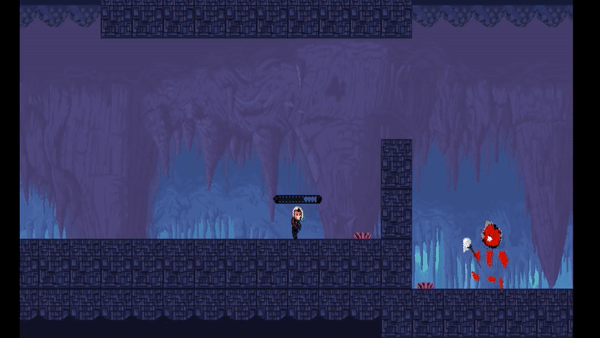

# ProjectOcram

Final project for a Monogame class at la Cité. 

A group project was tasked to create a brand new platforming game for a final grade for the course. This project was coded in C#.

The main premise of the game is to reach the end of the game without dying once. You can shoot lasers or jump to bypass the obstacles.

## In the game, we have basic movement of the main character. He also can dash left & right. 

## Platforms and health depleting.

## Mini Boss fight with jumpable platforms.

## Link for full project in action. 

https://www.youtube.com/watch?v=0mpXRp0gaw8
